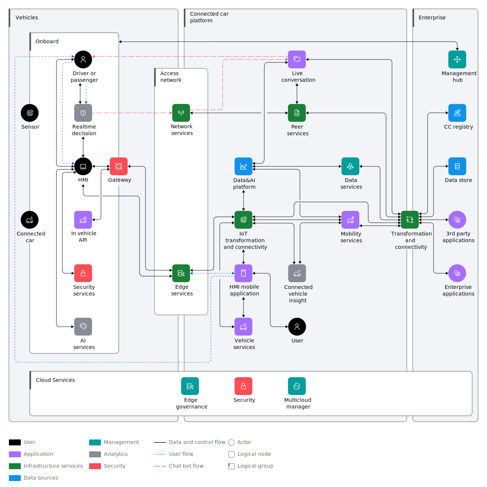

---

copyright:
  years: 2024
lastupdated: "2024-05-06"

keywords: 

subcollection: industry-ref-arch

authors:
  - name: 
    url: 

version: 1.0

deployment-url: 

docs: https://cloud.ibm.com/docs/industry-ref-arch

use-case: AutomotiveIndustry

industry: Automotive

content-type: reference-architecture

---

{{site.data.keyword.attribute-definition-list}}

# Automotive
{: #automotive}
{: toc-content-type="reference-architecture"}
{: toc-industry="Automotive"}
{: toc-use-case="AutomotiveIndustry"}
{: toc-version="1.0"}

The architecture calls for the ability to deploy scalable apps to the vehicle and to analyze and visualize insights from the data that comes from the sensors in and around the vehicle. Several product lines broadly map into the three layers of the architecture: edge services, IoT automotive platform, hybrid cloud with security, and data and AI services that span across the architecture.

## Architecture diagram
{: #architecture-diagram}

{: caption="Figure 1. Automotive High Level Diagram" caption-side="bottom"}

The IBM Automotive architecture has three layers. Moving from left to right in the diagram, the first layer is the vehicle layer, which is followed by the connected vehicle platform layer and the enterprise hybrid multicloud layer. 

The heart of the IBM connected vehicle AI platform is the mobility services application, which propels the vehicle by using a Human-Machine Interface (HMI). HMI is a haptics- and voice-enabled UX device that fronts the onboard intelligence. People in the vehicle use the HMI to communicate with the vehicle. A version of the HMI is available as a mobile app that automatically synchronizes with the onboard capability. Secure workloads are deployed as microservices.

The Automotive architecture has these functional requirements:

* Securely communicate with the vehicle from within or outside the vehicle
* Offer real-time inference and AI analytics onboard the vehicle for improved in-vehicle productivity
* Supplement the Connected Vehicle Platform with the ability to manage services at scale
* Analyze data at the source for collision avoidance systems and predictive maintenance

The challenges in the realm of mobility services and vehicle-to-everything (V2X) communication are unique:

* Support for high throughput and real-time telematics data ingestion, process, and analytics 

  * Through analytics of the telematics data, promote driver safety and navigate through better driving conditions on the road
  * Help to increase lifestyle efficiency
  * Help to avoid collisions, reducing insurance costs

* Provide comprehensive and flexible APIs to enable application developers to implement cross-domain business applications.

A connected vehicle depends on its supporting networks. Many networks are involved in the architecture, both inside and outside the vehicle. The networks that are inside the vehicle have unique protocols and a wide range of data rates. On the low end of data rates, the Local Interconnect Network (LIN) is used for low-speed applications like sensors and actuators at 20 kbps. On the higher end of data rates, Ethernet is used for high-speed applications such as infotainment and advanced driver-assistance systems (ADAS). Wireless interfaces, such as 3G, 4G, future 5G, BT, wifi, and V2X, operate at 100 Mbps to gigabit speeds.

## Requirements
{: #requirements}

The following represents a typical set of requirements that are deployed in a connected vehicle solution.

| Title | Description |
| ----- | ----------- |
| Sensor | The sensor, which provides a measurement that is meaningful for the physical entity (for example, location, temperature, humidity, traffic, and vehicle sensors). It may or may not be physically attached to the physical entity. Includes sensors and devices with built-in instrumentation such as RFID trackers, weight tracking, intelligent LED lighting, and others that acquire data or are controlled intelligently. | 
| Connected car   | Physical vehicle connected with the sensors and the internet.  | 
| Driver or Passenger| Person sitting in the vehicle.    |
| Real-time decision | Acquire data from sensors and systems for analysis and real-time decision making.    |
| HMI    | A Human-Machine Interface (HMI) is a user interface or dashboard that connects a person to a machine, system, or device. It provides entertainment to the passengers and more control, safety, and precision to the drivers.   |
| In-vehicle API  | Common set of services needed by Mobility as a Service, for example, eCommerce portals for pizza delivery, communication, Bluetooth, vehicle navigation, and onboard diagnostics.   |
| Security services | Services that provide access management to the vehicle.      |
| AI services     | Services that allow data scientists, developers, and retail business domain experts to drive improved business results and customer experience through the infusion of AI. Enables you to securely use your own data and to use licensed and public external data in a governed way to create, train, and deploy self-learning models.         | 
| Gateway         | An IoT gateway that is typically run on premises (in a plant or warehouse). The gateway is responsible for connecting SCADA systems, sensor gateways, and devices to the IoT platform. To do this, it receives device data from device and industrial protocols, formats the data as needed, and uses an IT protocol to communicate with the platform. It might also do filtering and aggregation of the data.                |
| Network services  | Provides network capability to deliver content through the Internet (DNS, CDN, firewall, and load balancer).     |
| Edge services   | DNS, firewall, and load balancer. |
| Data & AI platform | Contains machine learning (ML) and AI workloads, data analytics, model lifecycle management, visual services, BigData, data warehouse, and data quality.|
| IoT transformation and connectivity     | Data IoT transformation and connectivity services, API connectivity, and data connectivity.  |
| HMI mobile application | Human Machine Interface application. Mobile, iPad, or any device that can run applications.  | 
| Vehicle services  | V2X, Software Services (OTA) such as upgrade and maintenance, diagnostics, battery health, and vehicle health.   |
| Live conversation | Live conversation and chatbots for car manuals, feature functions, car assistance, and help. Connected to Peer Services to order the services on a third-party cloud.        |
| Peer services   | IBM or third-party cloud system that provides services to bring data and capabilities to the social platform. Connect and order any services directly from the car through Peer Servies, such as McDonalds and Starbucks, subscription services like Pandora, and third-party services like Netflix and Spotify.          |     |
| Connected vehicle insight               | Services such as context map, driver behavior, data transformation, real-time analytics, geo-spatial analytics, and BigData.      | 
| Data services   | Brings all the third-party external data on the platform, like Twitter and weather data.     |
| Mobility services | Application runtime. Supports application logic, which is part of an AI Solution built on the Connected Vehicle platform. The platform interacts with information in the data lake, external services, and workflow as needed. Examples are mWallet, concierge, infotainment, mServices, car sharing, and taxi.           |
| User   | User connected to a web application or using a mobile application.  | 
| Transformation connectivity             | Classical service bus functionality for decoupled integration of systems and machines, taking over integration logic, systems, and machines. Provides relief from integration-specific logic and enables standardization of maintenance and release management.              |
| Connected Car (CC) Registry             | A database of registered vehicles that is available to authorized entities.          |
| Data store      | Provides the persistence layers to power the cloud app to store, collaborate, visualize, share, and gain insights from data.      |
| Management hub  | Recognition, patch, lifecycle, compliance, and security management of edge devices, industrial robots, and automobiles.           |
| Third-party applications                | Third-party applications such as security apps or reporting apps that might be integrated as part of the solution.                |
| Enterprise applications| Applications that accomplish business goals and objectives and that can interact with cloud services.            |
| Edge governance | Provides and enforces appropriate in-service lifespan of devices. Plans smooth, non-disruptive, and secure changeover as new systems and capabilities are introduced.        |
| Security        | Security is pervasive through all layers of the architecture. Existing systems (such as MES, SCADA, and devices) already have their own security models. Manages both IT and Operations Technology security elements.     |
| IBM Cloud Pak for Multicloud Management | IBM Cloud Pak for Multicloud Management is the enterprise-grade multicloud management solution for Kubernetes.   |
{: caption="Table 1. Requirements" caption-side="bottom"}

## Nonfunctional requirements

Automotive architectures must satisfy several nonfunctional requirements.
 
### Security
Every connection in and out of the connected vehicle must use a secure protocol. All data in transit must be sent over secure protocols and any data that is stored in the cloud or data center must be encrypted. When connected vehicles and related devices are onboarded, use keys, certificates, or tokens.

### Response time
Speed is synonymous with mobility. MaaS architectures require minimal latency because decisions must be made quickly whether the communication is between two vehicles or between a moving vehicle and infrastructure.

### Connectivity
MaaS is a special case of connected cars, and connected cars require on-demand connectivity. The connectivity can be local, to the cloud, or to a satellite.

Availability, maintainability, and scalability must also be addressed in a MaaS architecture.

## Components
{: #components}

Update the following table below with components that are unique to this architecture. Introduce the table with a sentence. For example, "The following table outlines the products or services used in the architecture for each aspect."

| Aspects | Architecture components | How the component is used |
| -------------- | -------------- | -------------- |
| Compute | PowerVS | Web, App, and database servers |
| Storage | PowerVS | Database servers shared storage for RAC |
|  | VPC Block Storage | Web app storage if neededt |
| Networking | VPC Virtual Private Network (VPN) | Remote access to manage resources in private network |
|  | Virtual Private Gateway & Virtual Private Endpoint (VPE) | For private network access to Cloud Services, e.g., Key Protect, COS, etc. |
|  | VPC Load Balancers | Application Load Balancing for web servers, app servers, and database servers |
|  | Public Gateway | For web server access to the internet |
| Security | IAM | IBM Cloud Identity & Access Management |
|  | BYO Bastion Host on VPC VSI | Remote access with Privileged Access Management |
|  | Key protect or HPCS | Hardware security module (HSM) and Key Management Service |
|  | Secrets Manager | Certificate and Secrets Management |
| Resiliency | PowerVS | Multiple PowerVS on separate physical servers with VM and Storage anti-affinity policy |
| Service Management | IBM Cloud Monitoring | Apps and operational monitoring |
|  | IBM Log Analysis | Apps and operational logs |
|  | Activity Tracker Event Routing | Audit logs |
| Other  use if there is  additional aspect(s)  Name Aspect | Cell content | Cell content |
{: caption="Table 2. Components" caption-side="bottom"}

