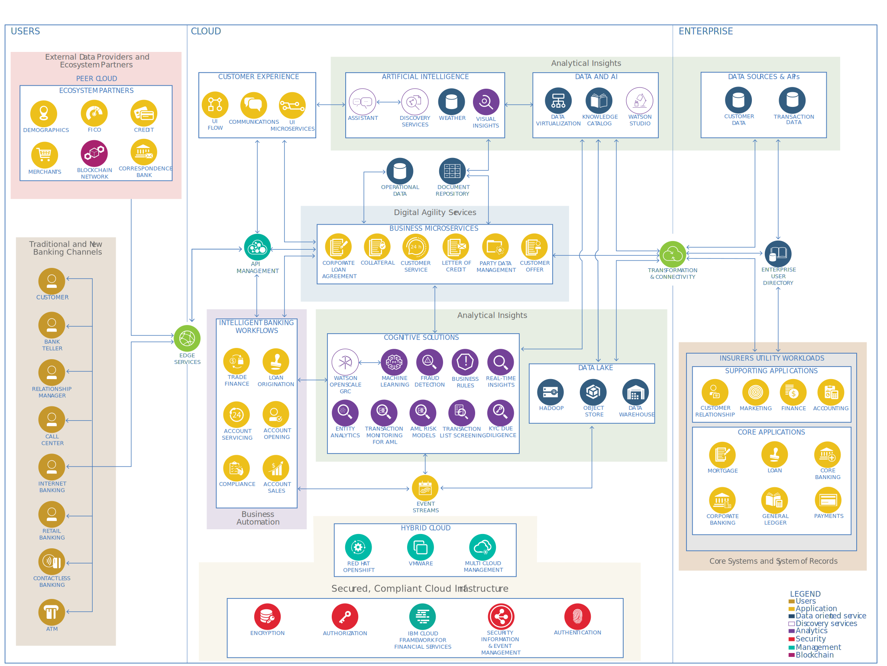

---

copyright:
  years: 2024
lastupdated: "2024-05-06"

keywords:

subcollection: industry-ref-arch

authors:
  - name:
    url:

version: 1.0

deployment-url:

docs: https://cloud.ibm.com/docs/industry-ref-arch

use-case: BankingAndFinanceIndustry, BankingCustomerExperience, BankingSecurity, CloudBanking, CoreBanking, FinanceTransformation, Corporate finance, OpenBanking

industry: Banking, FinancialSector

content-type: reference-architecture

---

{{site.data.keyword.attribute-definition-list}}

# Banking applications
{: #banking-app}
{: toc-content-type="reference-architecture"}
{: toc-industry="Banking, FinancialSector"}
{: toc-use-case="BankingAndFinanceIndustry, BankingCustomerExperience, BankingSecurity, CloudBanking, CoreBanking, FinanceTransformation, Corporate finance, OpenBanking"}
{: toc-version="1.0"}

The Banking industry reference architecture helps address three key industry imperatives:

* Reshape customer experience

   - Enable extreme convenience and instantaneous fulfillment to customers’ needs in their interactions with the bank
   - Compete with leaders across industries to provide experiences that meet and exceed customer expectations
   - Deliver integrated experiences that include the bank and business partners that provide services that add value to customers, such as concierge services

* Radically lower cost and operating expense

   - Streamline and modernize the application portfolio
   - Enable a highly efficient and interoperable hybrid multicloud environment
   - Reduce cost-to-income ratio and increase the return on investment, resulting in a positive operating use

* Increase security and compliance focus

   - Increase security capabilities that address rapidly changing industry cybersecurity needs
   - Reduce cost and improve effectiveness of risk and compliance operations
   - Address financial crimes, risk and compliance, and security and resiliency requirements

## Architecture diagram
{: #architecture-diagram}

{: caption="Figure 1. Banking application reference architecture" caption-side="bottom"}

The IBM Banking industry reference architecture is built over several technical domains. The heart of the architecture has three major domains.

Digital agility services

:   The digital agility services layer provides a microservices platform such as Financial Services Workbench, which is used to create container and containerized components running on secured cloud infrastructure. New application components are designed and developed in this platform by using the Domain-Driven Design method and by using BIAN and IFW models. These loosely coupled components interact with each other, external systems, or both through exposed APIs and messaging by using an API gateway and an enterprise event bus. Some examples of application components in this layer include party data management, customer offer, and loan agreement.

Business automation

:   The business automation layer provides a proven set of methods and tools that deliver on a value proposition to support the business process reengineering and transformation. Data and AI capabilities are used to collect, prepare, and govern data and to analyze and infuse insights in applications, processes, and business microservices. These capabilities are used for process automation, process mining and modeling, robotic process automation, content services, document processing, decision management, workflow orchestration, and task management.

Analytical insights

:   The analytics insights domain helps financial institutions transform to a cognitive enterprise by gaining the most value from the data in a cost-effective way, irrespective of data origin and data store. Insight services play a key role in delivering differentiated digital experiences to users, achieving higher growth through better insights and predictability. This domain provides capabilities that include an AI and machine learning platform, operational and main data stores, data warehouse and data lake, multicloud data access, integration and data virtualization, intelligent knowledge catalog, and data governance and lineage.

Several supporting domains integrate into the architecture domains.

Integration fabric

: The integration platform provides an automated, closed-loop approach that supports multiple styles of integration within a single, unified experience. This layer provides banks with end-to-end enterprise-grade security and encryption and many other capabilities:

    - Unlock business data and assets as APIs
    - Connect cloud and on-premises applications
    - Reliably move data with enterprise messaging
    - Deliver real-time event interactions
    - Transfer data across any cloud
    - Deploy and scale with cloud-native architecture and shared foundational services

Core systems and systems of record

:   This layer hosts the core product processing and operational support systems such as general ledger, payment processing, and customer master. In large banks, these applications are high-volume, mission-critical applications and often run on mainframe computers. While mainframe computing provides high availability, low latency, and high performance, banks are moving middle tier subsystems and processes to distributed and cloud environments to achieve better flexibility and deployment options.

:   Banking systems often require data from external data sources such as credit bureaus, regulatory bodies such as FinCEN and OFAC, third-party data aggregators such as Lexis-Nexis and Factiva, and public databases such as CFPB and Law Enforcement. Often, banking systems also connect with ecosystem partners such as payment gateways (SWIFT and ACH), correspondence banks, merchant and card networks, and financial technology (fintech) companies (online payments and crypto). This layer provides and manages secured connectivity to these external data providers and other ecosystem partners.

Traditional and new banking channels

:   This domain enables applications that allow customers to interact with the bank through multiple channels such as online banking, mobile applications, brick and mortar branches, e-branches, ATMs, and virtual agents. With the rise of fintechs, a customer can interact with a bank through several new channels. For example, a bank customer can ask about current loan interest rates on Zillow. This domain addresses the specific needs of omnichannel applications, including channel APIs, authentication and authorization, personalization, seamless and integrated cross-channel experience, and customer-centric processes.

Secured, compliant cloud infrastructure

:   This layer provides cloud infrastructure that is designed to build trust and enable a transparent public cloud ecosystem with the specific features for security, compliance, and resiliency that financial institutions require. It enables delivery against regulatory imperatives through a consistent set of embedded controls that are designed to meet the needs of financial institutions’ control stakeholders. Those stakeholders include Chief Risk Officers (CROs), Chief Compliance Officers (CCOs), Chief Information Security Officers (CISOs), and Chief Privacy Officers (CPOs).

## Nonfunctional requirements
{: #nonfunctional-requirements}

A banking industry architecture has several nonfunctional requirements.

Security

:   All application systems must implement robust controls over their communication network for these purposes:

    - Safeguarding data
    - Tightly controlling access to network devices through management approval and subsequent audits
    - Disabling remote communications when no business need exists
    - Logging and monitoring remote access
    - Securing remote access devices
    - Using strong authentication and encryption to secure communications

:   All confidential bank data must be encrypted while in transit on any network or stored on any device on premises, or on a private or public cloud. Confidential bank information, including authentication credentials, must be encrypted while in transit over any public network or wireless network. Key management procedures must be employed that assure the confidentiality, integrity, and availability of cryptographic key material. The use of encryption products must comply with local restrictions and regulations in the relevant country.

Scalability

:   The architecture must be able to support large-scale deployments. The largest banks in the world support more than 300 million customers, over a billion transactions per day, and manage assets of more than USD 4 trillion. The architecture must not only meet the current requirements but also anticipate the future needs of a dynamic, growth-focused institution. The infrastructure must boost the business, not limit it. It must provide a demonstrated ability to scale and align to the business objectives as the financial institution grows.

Availability

:   Financial institutions need to operate in a 24 x 7 environment. The infrastructure must be available to the customers whenever they want, wherever they are, and on whatever channel they prefer to interact. Mission-critical applications such as payment processing and other core banking transaction processing might require 99.999% availability.

Performance and response times

:   Some of the application components in the banking industry need a high throughput, low-latency, real-time performance. Examples include card authorizations and transactions, payment transactions, fraud detection, and securities processing.

Business continuity and disaster recovery

:   Application systems must have formal documented recovery plans and tools to identify the resources and specify actions that are required to minimize losses if a disruption occurs to the business unit, its supporting group units, applications, or infrastructure components. Business continuity and disaster recovery (DR) plans ensure timely and orderly recovery of the business, support processes, operations, and technology components within an agreed-upon timeframe. These plans include the orderly restoration of business activities when the primary work environment is unavailable.

:   Backup and offsite storage

All application systems must have a defined backup policy and associated procedures for backing up data in a scheduled and timely manner. Effective controls must be established to safeguard backed-up data onsite and offsite. They must also ensure that the bank data is securely transferred or transported to and from backup locations and conduct periodic tests to ensure that data can be safely recovered from backup devices.

## Components
{: #components}

The following represents a typical set of components in banking applications.

| Title | Description |
| ----- | ----------- |
| Demographics	| Statistical data that is related to users of the bank’s services, which include both individual and organizational customers and prospects. The data can include basic information such as gender, marital status, education, location, and financial behavior. This data is used to provide more personalized services to the bank’s customers.	|
| FICO	| An analytics company that helps businesses make better decisions that drive higher levels of growth, profitability, and customer satisfaction. A FICO Score is a three-digit number that is based on the information in a customer’s credit reports. The score helps lenders determine the customer’s credit worthiness and ability to make loan payments.	|
| Credit	| Credit reporting agencies include Equifax, Experian, and TransUnion, S&P Global, Moody’s and Fitch Ratings. They perform credit assessment and evaluation for individuals and organizations.	|
| Merchants	| An individual or an organization that is engaged in commerce.	|
|Correspondence bank	| A financial institution that provides services to another financial institution, which is usually located in another country. A correspondence bank acts as an intermediary or agent, facilitating wire transfers, conducting business transactions, accepting deposits, and gathering documents on behalf of another bank.	|
| Blockchain network	| A business network for running shared transaction processes that span business partners. The network is implemented by using blockchain technology.	|
| UI flow	| User interface (UI) flows are system models that show how different pages of a user interface are connected and how a user can step through various pages of the system. UI flows are typically composed of screens and navigation paths between various screens.	|
| Communications	| The component that is responsible for all communications with customers, including notifications, emails, and voice-based interactions.	|
| UI microservices	| Running instances of your code inside of a container.	|
| Assistant	| A conversational AI platform.	|
| Discovery services	| Discovery services ingest, parse, index, and annotate content by using cognitive functions.	|
| Weather	| Actionable weather-based insights that are used for driving business processes to optimize operations, reduce costs, improve safety, and uncover new revenue opportunities.	|
| Visual insights	| An image and video analytics platform.	|
| Data virtualization	| Data virtualization supports the democratization of data across the enterprise and enables seamless consumption by authorized stakeholders across boundaries, such as cloud workloads and on-premises data.	|
| Knowledge catalog	| The knowledge catalog identifies organization-wide data and is used for educating stakeholders across the enterprise.	|
| AI studio	| A component that helps to build, run, and manage AI models.	|
| Customer data	| Enterprise sources of information about customer information, including profile, interactions, and transactions.	|
| Transaction data	| Enterprise data that is sourced from core systems that are relevant to transaction processing, such as claims data and medical data.	|
| Customer	| A user who interacts with the bank through various channels, such as web, mobile, or customer service call center.	|
| Bank teller	| Front-line bank customer service employees that provide basic banking services and complete routine financial transactions for account holders and the public.	|
| Relationship manager	| Bank employees who work to improve business relationships with partner firms and clients.	|
| Call center	| A centralized business unit to which phone calls from current and potential customers and distribution partners are directed. It acts as a communication channel that customers use to make requests with the bank or register complaints.|
|Internet banking	| Banking services that are offered over the internet to customers and prospects. Internet banking provides almost every service that is traditionally available through a local branch, including deposits, transfers, and online bill payments.	|
| Retail banking	| Financial services that are provided to individual customers.	|
| Contactless banking	| A secure method for consumers to purchase products or services by using a debit, credit, smartcard, or another payment device by using RFID and other near-field communication technologies.	|
| ATM	| An electronic banking outlet that allows customers to complete basic transactions without the aid of a branch representative or teller.	|
| Edge services	| Edge services include the network service capabilities that are required to securely and effectively deliver content to client devices and applications through the internet.	|
| API management	| API management capabilities advertise the available service endpoints that the mobile gateway has access to. These capabilities include API discovery, catalogs, connection of offered APIs to service implementations, and management capabilities such as API versioning. IBM® API Management for Cloud and StrongLoop® provide these capabilities.	|
| Operational data	| Data that is generated as part of banking business processes and day-to-day operations, including banking transactions and payments.	|
| Document repository	| A system and database that is used to receive, track, manage and store documents.	|
|Trade finance	| Business processes that are related to financial instruments and products that are used by companies to facilitate international trade and commerce.	|
| Loan origination	| Business processes that are related to applying for and opening a loan account with the bank.	|
| Account servicing	| A component to manage customer interactions and communicate with them to resolve their requests and complaints.	|
| Account opening	| Business processes that are related to opening a banking account.	|
| Compliance	| Business processes that are associated with ensuring that the bank adheres to external and internal controls.	|
| Account sales	| Business processes that are related to customizing and selling banking products to existing and new customers.	|
| Corporate loan agreement	| A business microservice that captures and maintains the legal terms and conditions for a sold corporate loan product.	|
| Collateral	| A business microservice that supports the management allocation and recovery of collateral that is associated with a customer loan.	|
| Customer service	| A business microservice that brings together the fulfillment capabilities for various customer servicing support functions, in particular, for customer-related actions that span products and services, such as customer case resolution and analysis and customer orders.	|
| Letter of credit	| A business microservice that is responsible for orchestrating the pricing and issuance of letters of credit, which is typically associated with trade finance activity.	|
| Party data management	| A business microservice that maintains a potentially wide range of party reference data that might be used in any interaction between the bank and the party that it does business with, including relationship development, sales and marketing, servicing, and product delivery.	|
| Customer offer	| A business microservice that processes any allowed combination of product or service offers for customers.	|
| Transformation and connectivity	| This component helps to securely connect microservices that run in IBM Cloud and data or applications that run on premises or in other clouds.	|
| Enterprise user directory	| A user directory that contains the authentication details of all of the respective stakeholders. An example is the Microsoft® Active Directory.	|
| AIOps | A component that helps to operationalize trusted AI.	|
| Machine learning	| This process enables carriers to define algorithms to enable their analytics models to self-learn based on different data dimensions.	|
| Fraud detection	| This activity enables carriers to detect fraud in banking transactions.	|
| Business rules	| A component that manages business rules independent from applications and processes.	|
| Real-time insights	| This component analyzes the broadest range of streaming data, making decisions while events are happening. It provides continuous data ingest and analytical processing across multiple event streams. It ats on events and event streams through business rules.	|
| Entity analytics	| A business component that analyzes customer, counterparty, and related entity risk.	|
| Transaction monitoring for AML	| The component that provides transaction monitoring of customer behavior for suspicious money laundering activity.	|
| AML risk models	| Analytical models to evaluate AML risk scores.	|
| Transaction list screening	| Analytical models to screen transactions against sanctions.	|
| KYC due diligence	| Analytical models to evaluate KYC due diligence score.	|
| Distributed database | A distributed database for storing and processing large data sets across the network.|
| Object store	| Unstructured data storage for large document data sets.	|
| Data warehouse	| Historical data that is used for reporting and data analysis.	|
| Customer relationship	| Solutions that are designed to engender loyalty and trust from both new and existing customers. This component typically includes a customer relationship system to provide after-sales services and to track and manage customer interactions, and a loyalty system to calculate customer loyalty as a stored value. The customer can view, transfer, and redeem this stored value.	|
| Marketing	| This function enables carriers to define strategies for enabling their selling activities across focused customer segments.	|
| Finance	| This function supports all enterprise financial activities, such as accounting, accounts payable and receivable, and general ledger.	|
| Accounting	| An enterprise information system that is used to manage the income, expenses, and other financial activities of the enterprise.	|
| Mortgage	| Banking systems that handle the fulfillment of a loan product that is intended for the purchase of a property.	|
| Loan	| Banking systems that handle lending products such as student loans, personal loans, and auto loans.	|
| Core banking	| Banking systems that handle the administration of core banking products such as savings, checking, money markets, and other products.	|
| Corporate banking	| Banking systems that handle administration of corporate banking products such as corporate lending, corporate deposits, and trade financing.	|
| General ledger	| A record-keeping system to maintain the accounting transactions.	|
| Payments	| A banking system that supports payment transactions, including the various connections to payment networks, central cash management, and check processing.	|
| Container platform	| A cloud container platform that is built on open-source projects such as Kubernetes. It provides a scalable and reliable cloud platform that runs on your on-premises infrastructure or with resources in a public cloud.	|
| VMware	| Aggregated infrastructure resources, including servers, storage, networking, and more. Those resources are presented as a unified, virtualized, shared pool despite underlying differences in hardware.	|
| Multicloud management	| Multicloud management provides end-to-end management visibility and control for Kubernetes environments. Capabilities include cluster creation, application lifecycle, and security and compliance across data centers and hybrid cloud environments.	|
| Encryption	| This activity supports encrypting data in motion and at rest by using industry standard CIPHER algorithms.	|
| Authorization	| Authorization manages access rights, provides single sign-on from any device, enhances security with multifactor authentication, enables user lifecycle management, and protects privileged accounts	|
| Authentication	| Authentication allows you to add authentication to web and mobile apps without requiring code changes or redeployment. It supports advanced security capabilities, such as multifactor authentication (MFA), single sign-on (SSO), and user-defined password policies.	|
| Security information and event management (SIEM)	| SIEM software gives enterprise security professionals both insight into and a track record of the activities within their IT environment.	|
| Secure cloud platform	| A cloud that is designed to build trust and enable a transparent public cloud ecosystem with the features for security, compliance, and resiliency that financial institutions require. |
| Event streams	| Event streams build intelligent, responsive applications that react to events in real time, delivering more engaging client experiences. This component supports managing business events in the form of streams across the enterpise by using industry standard platforms such as Apache Kafka. Event streams support publish-and-subscribe communication, an event log, and simple event stream processing. |
{: caption="Table 1. Components" caption-side="bottom"}
