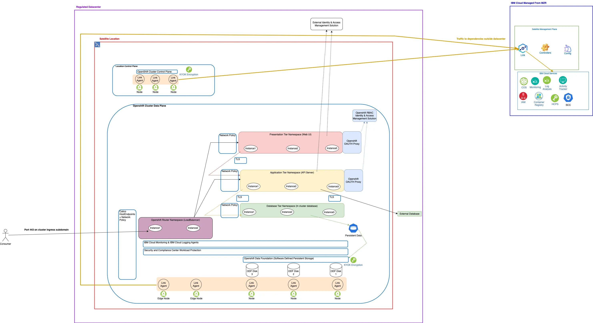

---

copyright:
  years: 2024
lastupdated: "2024-05-13"

keywords:

subcollection: industry-ref-arch

version: 1.0

deployment-url:

use-case: GovernmentIndustry

industry: Government

content-type: reference-architecture

---

{{site.data.keyword.attribute-definition-list}}

# IBM Cloud Satellite for Government
{: #government}
{: toc-content-type="reference-architecture"}
{: toc-industry="Government"}
{: toc-use-case="GovernmentIndustry"}
{: toc-version="1.0"}

This architecture demonstrates the best practices with IBM Cloud Satellite deployments for government.
{: shortdesc}

## Architecture diagram
{: #architecture-diagram}

{: caption="Figure 1. Best Practice Architecture for Regulated Government Applications in IBM Cloud Satellite" caption-side="bottom"}

The overall architecture consists of a three tier application (presentation, application, database) deployed in a IBM Cloud Red Hat Openshift cluster in a Satellite location within a regulated on-prem datacenter. In this design: the presentation tier has a basic webpage that displays content fetched from an API in the application tier. The application tier connects to the database tier to determine the content to display. Let’s now walk through the request flow starting from the consumer of the three tier application outside the regulated datacenter.

**Client -> Load balancer (Openshift Router)**

The consumer accesses either the presentation tier or the application tier components through the openshift router. The traffic is sent to the openshift router through the clusters ingress subdomain. The ingress subdomain DNS maps to a select number of edge worker nodes in the cluster. Once the traffic reaches the edge worker nodes: policy is placed in the cluster to restrict ingress access as appropriate in the environment. The firewall policy is distributed across cluster nodes resulting in no single point of failure along with a scalable firewall solution (just add more nodes to the edge worker pool) versus various legacy deployments with a set device that firewalls the entire environment (and is a single point of failure).

**Openshift Router -> Presentation Tier**

After the traffic reaches the openshift router: the openshift router will use route configuration to forward the traffic to the appropriate backend microservice. A few things on this configuration:
   * Traffic is encrypted with TLS from the client to the openshift router. The openshift router then terminates TLS and establishes another TLS connection to the backend presentation tier app. This means that traffic is always encrypted through TLS throughout the entire path of transferring the network.
   * Only supporting local cluster monitoring services and openshift ingress are allowed to send traffic into the namespace.
   * Openshift oauth proxy is utilized to validate individual user access to the presentation tier. The openshift oauth proxy utilizes IBM Cloud IAM and Openshift RBAC to validate a user has access to specific resources before allowing them to proceed to access the application.

This gives a pluggable solution without any dependencies outside the Satellite platform to authenticate and authorize users for applications. Often times government organizations will already have an approved local IAM system and that can also be utilized (typically built into the backend applications that are deployed in the environment). When using those: just ensure the network policy is also updated to allow the presentation tier application to utilize the necessary endpoints for the external identity and access management solution.

**Openshift Router -> Application Tier**
**Presentation Tier -> Application Tier**

The application tier will be accessed both externally (directly calling APIs) and through the applications running in the presentation tier. Since the APIs will also be able to be accessed externally: ingress is allowed from the openshift-ingress namespace. Additionally: ingress is allowed from the presentation tier to talk to the dependent APIs so the presentation tier can properly display webpages. For egress: the application tier is allowed to talk to the backend database (deployed locally in the cluster) and openshift DNS.

The usage of the common openshift service CA operator enables encryption in transit of traffic both from external clients directly to APIs and from the presentation tier to APIs.

**Application Tier -> Database Tier**

The database tier has no external dependencies and runs a local database. The network policy to implement ingress and egress controls allows ingress from the application tier to successfully execute the API suite the application tier provides. The database deployment utilizes ODF encrypted with IBM HyperProtect Crypto Services Keep Your Own Key Encryption.

The storage template that deploys ODF contains the configuration to link it to the backend HCPS instance that will hold the keys that encrypt all the persistent storage ODF manages.

With this deployment model: encryption at rest has been implemented at a rest for all application data as well. The platform administrator controls access to the keys through HCPS and can revoke access/keys at any time and effectively stop access to any local persistent data in the Satellite environment.
