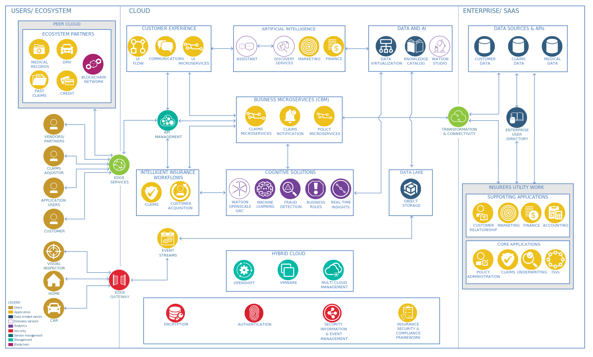

---

copyright:
  years: 2024
lastupdated: "2024-05-06"

keywords:

subcollection: industry-ref-arch

authors:
  - name:
    url:

version: 1.0

deployment-url:

docs: https://cloud.ibm.com/docs/industry-ref-arch

use-case: Insurance, Insurance customer experience

industry: Insurance

content-type: reference-architecture

---

{{site.data.keyword.attribute-definition-list}}

# Insurance
{: #insurance}
{: toc-content-type="reference-architecture"}
{: toc-industry="Insurance"}
{: toc-use-case="Insurance, Insurance customer experience"}
{: toc-version="1.0"}

The insurance industry faces a range of challenges. A new generation of customers expects individualization, responsiveness, integration, and seamless experiences. Insurance products and services don't always fit this new demand. The industry also faces new sources of competition. Technology-driven insuretechs and non-traditional entrants into the insurance market are increasingly disrupting its business. To effectively compete, the industry must find new business models.

Another challenge is finding ways to retain participants’ financial assets that are held in employers’ retirement plans. Withdrawals from these plans are often triggered when a person moves to a new employer or retires. Financial and regulatory pressures that are related to privacy, security, and solvency are a constant. Finally, insurance companies must deal with the increase in fraud incidence, sophistication, and severity.

A cloud-based insurance architecture enables the customer experience, claims, and acquisition processes by using insights from data and AI for decision making in processes, applications, and business services. The architecture assists secured integration across its own applications, personas interacting with the insurance enterprise, and enterprise ecosystem partners, service providers, and regulatory institution applications.

## Architecture diagram
{: #architecture-diagram}

{: caption="Figure 1. Insurance reference architecture" caption-side="bottom"}

The IBM Insurance reference architecture is a hybrid cloud architecture that contains three layers. Moving from left to right in the diagram, the first layer depicts personas such as the customer, agent, and claims adjuster. It also includes entities such as homes and cars and ecosystem partners such as the Department of Motor Vehicles (DMV), utilities, hotels, and rental cars that interact with the insurance hybrid cloud platform.

The cloud layer and the enterprise form the hybrid cloud layer. These layers provide a compliant and secure infrastructure for several components and capabilities:

Container and containerized components that provide digital business automation through business events, processes and rules, and business microservices
Data and AI capabilities to collect, prepare, and govern data and to analyze and infuse insights in applications, processes, and business microservices
Applications, processes, and services within and outside the enterprise that are integrated with ecosystem partners and core and supporting enterprise and independent software vendor (ISV) applications
This architecture enables customer acquisition, claims, the customer experience process, and business functions.

## Nonfunctional requirements
{: #nonfunctional-requirements}

Insurance industry architectures must satisfy several nonfunctional requirements.

* Security

Every connection in and out of the enterprise must be secured. All data in transit must be sent over secure protocols and any data that is stored in the cloud or data center must be encrypted. Customers, claims adjusters, and agents must be authenticated and checked for authorization before they're allowed access to business functions. All controls for audits and compliance must be provided.

* Response time

Speed is synonymous with a better customer experience. Insurance architectures require minimal latency because decisions must be made quickly whether the communication is between customers, adjusters, agents, or ecosystem partners.

* Connectivity

Insurance cloud platforms must provide secured connectivity with many entities:

    - The agents' infrastructure
    - Ecosystem partners such as utilities, rental car companies, hotels, the DMV, credit agencies, medical providers, payers, auto repair facilities, home repair contractors, cars, and homes
    - Enterprise and ISV applications that run on premises

Availability, maintainability, and scalability must also be addressed in an insurance architecture.

## Components
{: #components}

The following represents a typical set of components in insurance applications.

| Title | Description |
| ----- | ----------- |
| Medical records | Insured or prospect medical records that are stored in data centers by business partner providers such as doctors and hospitals. |
| Department of Motor Vehicles (DMV)   | A government organization that provides DMV reports for all US Insurance Carriers. This entity also manages the issuance, cancellation, and citation for all driver's licenses.    |
| Past claims | Historical claims data.    |
| Credit    | An external service that provides credit data about applicants or insureds.   |
| Blockchain netework	| A business network for executing shared processes that span multiple business partners. The network is implemented by using blockchain technology.	|
| Vendors and partners	| Third parties.	|
| Claims adjustor	| The claims representative of the insurer who normally deals with claims processing and adjudication.	|
| Application users	| Users who access the insurer's system and applications, such as analytics, marketing, loyalty, and others.	|
| Customer	| A user who interacts with an insurer through various channels, such as web, mobile, or customer service.	|
| Visual inspector	| A mobile app that enables the capture, training, and recognition of visual images.	|
| Home	| The dwelling of a policy holder.	|
| Car	| An insured automobile.	|
| Edge services	| Edge services include the network service capabilities that are required to securely and effectively deliver content to client devices and applications through the internet.	|
| Edge gateway	| This component serves as the gatekeeper for the cloud environment entry. It supports the filtering of rogue requests and other security aspects.	|
| UI flow	| User interface (UI) flows are system models that show how different pages of a user interface are connected and how a user can step through various pages of the system. UI flows are typically composed of screens and navigation paths between various screens.	|
| Communications	| The component that is responsible for all communications with customers, including notifications, emails, and voice-based interactions.	|
| UI microservices	| Running instances of your code inside of a container.	|
| API management	| API management capabilities advertise the available service endpoints that the mobile gateway has access to. These capabilities include API discovery, catalogs, connection of offered APIs to service implementations, and management capabilities such as API versioning. IBM API Management for Cloud and StrongLoop provide these capabilities.	|
| Claims	| A core function that deals with claims functions such as intake, triage, and processing.	|
| Customer acquisition	| The component that is responsible for orchestrating the customer acquisition process. This component can be realized by using a workflow or an event-action controller.	|
| Event streams	| Event streams build intelligent, responsive applications that react to events in real time, delivering more engaging client experiences. This component supports managing insurance events in the form of streams across the enterpise by using industry standard platforms such as KAFKA. Event streams support publish-and-subscribe communication, an event log, and simple event stream processing.	|
| Assistant	| A conversation AI platform.	|
| Discovery services	| Discovery services ingest, parse, index, and annotate content by using cognitive functions.	|
| Marketing	| This function enables carriers to define strategies for enabling their selling activities across focused segments.	|
| Finance	| This function supports all insurance carrier financial activities, such as accounting, account payables and receivables, and general ledger.	|
| Claims microservices	| Running instances of your code inside of a container.	|
| Claims notification	| The business microservice that is responsible for claims notifications.	|
| Policy microservices	| Running instances of your code inside of a container.	|
|Machine learning	| This process enables carriers to define alogorithms to enable their analytics models to self-learn based on different data dimensions.	|
| Fraud detection	| This activity enables carriers to detect fraudulent cases in the claims area.	|
| Business rules	| A component that manages business rules independent from applications and processes.	|
| Real-time insights	| Analyzes the broadest range of streaming data, making decisions while events are happening in real time. Provides continuous ingest and analytical processing across multiple event streams. Acts on events and event streams through business rules.	|
| Data virtualization	| Data virtualization supports the democratization of data across the enterprise and enables seamless consumption by authorized stakeholders across boundaries, such as cloud workloads and on-premises data.	|
| Knowledge catalog	| The knowledge catalog organization-wide data for educating stakeholders across the enterprise.	|
| Object storage	| Cloud object storage (data lake).	|
| Transformation & connectivity	| This component helps to securely connect microservices that run in the cloud and data or applications that run on-premises or in other clouds.	|
| Customer data	| Enterprise sources of information about customer informaion, including profile, interactions, and transactions.	|
| Claims data	| Enterprise data that is sourced from core systems that are relevant to claims processes.	|
| Medical data	| Insured or prospect medical records that are stored in the insurance company data center.	|
| Enterprise user directory	| A user directory that contains the authentication details of all respective stakeholders. An example is the Microsoft® Active Directory.	|
| Customer relationship	| Solutions that are designed to engender loyalty and trust from both new and existing customers. This component typically includes a customer relationship system to provide after-sales services and to track and manage customer interactions, and a loyalty system to calculate customer loyalty as a stored value. The customer can view, transfer, and redeem this stored value.	|
| Marketing	| This function enables carriers to define strategies for enabling their selling activities across focused segments.	|
| Finance	| This function supports all insurance carrier financial activities, such as accounting, account payables and receivables, and general ledger.	|
| Accounting	| An enterprise information system that is used to manage the income, expenses, and other financial activities of the insurer.	|
| Policy administration	| A core insurance function that deals with policy administration.	|
| Claims	| A core function that deals with claims functions such as intake, triage, and processing.	|
| Underwriting	| An insurance company role that undertakes the risk in lieu of a premium.	|
| ISVs	| An independent software vendor, also known as a software publisher. An ISV is an organization that specializes in making and selling software that designed for mass or niche markets.	|
| Watson OpenScale GRC| A component that helps to operationalize trusted AI |
| Watson Studio | A component that helps to build, run, and manage AI models. |
| Red Hat® OpenShift®	| A cloud container platform that is built on open-source projects such as Kubernetes. It provides a scalable and reliable cloud platform that runs on your on-premises infrastructure or with resources in a public cloud.	|
| VMware® | Aggregated infrastructure resources, including servers, storage, networking, and more. Those resources are presented as a unified, virtualized, shared pool despite underlying differences in hardware. |
| Multicloud management	| Multicloud management provides end-to-end management visibility and control for Kubernetes environments. Capabilities include cluster creation, application lifecycle, and security and compliance across data centers and hybrid cloud environments.	|
| Encryption |	This activity supports encrypting data in motion and at rest by using industry standard CIPHER algorithms.	|
| Authentication	| A component that delivers identiy and access management services for solution users.	|
| Security, Information and Event Managment (SIEM)	| SIEM software gives enterprise security professionals both insight into and a track record of the activities within their IT environment.	|
| Insurance security and compliance framework	| Insurance industry-informed IBM cloud controls that are required to operate securely with sensitive data in the public cloud.|
{: caption="Table 1. Components" caption-side="bottom"}
