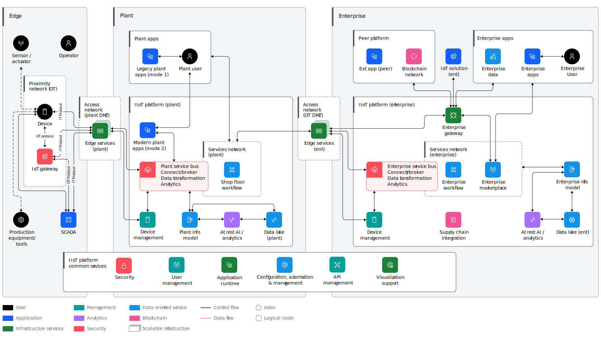

---

copyright:
   years: 2024, 2025
lastupdated: "2025-06-16"

keywords:

subcollection: industry-ref-arch

version: 1.0

deployment-url:

use-case: ManufacturingIndustry

industry: Manufacturing

content-type: reference-architecture

---

{{site.data.keyword.attribute-definition-list}}

# Manufacturing digitization in hybrid cloud
{: #manufacturing}
{: toc-content-type="reference-architecture"}
{: toc-industry="Manufacturing"}
{: toc-use-case="ManufacturingIndustry"}
{: toc-version="1.0"}

This reference architecture represents the generalization of practical experiences from hundreds of engagements around manufacturing digitization by IBM, Red Hat, and partners around the world. Based on hybrid cloud principles, it combines practices and lessons for the cloudification of the plants.

The 3-layered distributed reference architecture is the continuous representation of IBM’s experience in applying technology and running IT projects in manufacturing environments with these key features:

   * Open
   * Standards-based
   * Modular
   * Replaceable
   * Brownfield
   * Plant-specific
   * Vendor-independent

You can use the reference architecture to identify your existing and needed functions for digitization in manufacturing. With that information along with the implementation examples, you can create a concrete solution architecture.

## Architecture diagram
{: #architecture-diagram}

{: caption="Manufacturing High Level Diagram" caption-side="bottom"}

## Nonfunctional requirements
{: #nonfunctional-requirements}

Manufacturing architectures must satisfy several nonfunctional requirements.

* Performance:
   * Function offload to the edge. A centralized configuration is required with offload to the edge for rules-based decision making and streaming analytics.
   * Modular design. A microservices orientation allows for the modular design of IoT solutions.
   * Hybrid cloud. It must be possible to deploy the platform layer on premises, on the cloud, or partially on premises and partially on the cloud.
   * Unstructured and structured data. The system must handle structured data, including real-time messages and bulk transfer, and unstructured data, such as acoustic files, image files, recordings, and text documents.
   * User response time. The system must provide acceptable response times to users regardless of the volume of data that is being stored and the analytics that is happening in the background.
   * Real-time communications. Support is needed for bidirectional, real-time communications. This requirement is connected to the requirement for support of industrial or device protocols at the edge. Responses might need to happen in less than 1 second depending on the use case. This requirement also drives a need for edge-level analytics and decision making for that class of use cases.
   * Time series capture granularity. A timestamp at least to the millisecond is required so that even if that data is too late for real-time control, the catch-up analytics can see sequence of events.

* Scalability:
   * Horizontal scalability. The system must handle expanding load and data retention needs based on the upscaling of the solution scope, such as the addition of manufacturing facilities and buildings.

* Maintainability:
   * Adaptable and flexible. It must be possible to rapidly adapt the system to change the process, information, or participants that are being exchanged.
   * Maintainability and uptime. It must be possible to complete maintenance on the system without violating service level agreements for uptime. In a 24x7 environment, you must be able to do maintenance without completely taking down the system.

* Availability:
   * High availability. Some IoT solutions and domains demand highly available systems for 24x7 operations. This type of system isn't a critical production application, which means that operations or production don't stop if the IoT solution stops. You must confirm the actual expectation for the system.

* Security:
   * Device security. Devices must be able to register and communicate securely, such as by using TLS. Unauthorized devices are not allowed.
   * User security. User logon to any device must be secure and validated for their role. This requirement is connected to the LDAP or user registry that customers use.
   * Application security. Authorized users of the system that exchange information must be able to do so with the appropriate security controls.
   * Data security. All persisted data requires secure access.

* Volumetrics:
   * Big data. The system must be able to store and analyze volumes of data, both historical and current, on scales that are commonly known as *big data*.
   * Platform speed, capacity, and accessibility. The platform must support high volumes of data transmissions 24x7. This requirement includes support for remote locations and mobile data sources.

* Manageability:
   * Incident management. The system must include support for alerting, notification, and incident management.
   * Solution management. Support must exist for centralized solution management so that system support personnel can quickly determine the root cause of problems and fix them to avoid downtime.

* Usability:
   * Mobile support. Users must be able to interact in the same roles and on the same tasks on computers and mobile devices, where practical, given mobile capabilities.

## Components
{: #components}

The following represents a typical set of components that are deployed in a manufacturing solution.

| Architecture components | How the component is used |
| ----- | ----------- |
| Device| The device or programmable logic controller (PLC) is the representation and control of a physical entity or sensor that provides device information, which is accessible by using industrial protocols. Network integration for the device is part of the cyber portion of the device. The device is normally integrated by using operational technology (OT) protocols such as MODBUS/TCP, S7, and ProfiBUS/ProfiNET. The device can also be integrated by using IT protocols such as HTTP or MQ Telemetry Transport (MQTT). However, those protocols are less common and valid for newer devices.|
| IoT gateway | The IoT or edge gateway, which is typically run on premises in a plant or warehouse, is responsible to connect supervisory control and data acquisition (SCADA) systems, sensor gateways, and devices to the IoT platform. To do so, it receives device data by using device and industrial protocols, formats the data as needed, and uses an IT protocol to communicate with the platform. It might also filter and aggregate the data. Typically, it implements the Adaptor pattern and converts legacy manufacturing protocols, such as ProfiNet/ProfiBus, MODBUS, Open Platform Communications (OPC DA), and S7, into standard ones, such as Open Platform Communications United Architecture (OPC UA) and MQ Telemetry Transport (MQTT). Other functions include aggregation, filtering, operational rules, and the deployment of trained analytical models. A subject of device management, it is recently based on container or serverless functions.|
| Plant gateway or plant service bus | The plant service bus implements the Service Bus pattern within the shop floor by providing routing, mediation, and transformation functions at the factory or plant level. The plant service bus takes over the integration logic from the plant application, machines, and devices by reducing the complexity of point-to-point connectivity. It is complementary to a manufacturing execution system (MES), enabling the separation of concern between manufacturing process implementation and pure integration. Based on this modularity, the plant service bus guarantees vendor-independence and an open standards-based implementation. In addition to the base integration function, an MQTT Message Hub provides a scalable implementation of an MQTT Topic Tree. The business-level flexibility and rule-based configuration is based on a rules-management system that is tightly integrated with the integration logic. That integration enables business-level behavior adjustment without IT dependency, dramatically reducing the implementation and test lifecycle. Comfortable rules-based management is combined with wire-speed performance and instant rules activation that are driven by the business. IT enables continuous operation by letting the business define manufacturing logic by using natural language-based rules definitions and validation. |
| Enterprise gateway or enterprise service bus | The enterprise gateway or enterprise service bus provides classical service bus functions for the decoupled integration of systems and machines, taking over integration logic, systems, and machines. It provides relief from integration-specific logic and enables the standardization of maintenance and release management. |
| Operator | An operator typically completes tasks such as equipment operation, setup, and operations support tasks. The operator interacts with device or operations-specific user interfaces on systems that integrate with the IoT solution by using collected IoT and operations data. |
| Sensor or actuator| A sensor provides a measurement that is meaningful for the physical entity, such as location, temperature, or humidity. It might or might not be physically attached to the physical entity. Actuators, such as valves, are also represented by this entity. |
| Production equipment tools | These tools are objects or machines that are of interest and subject to sensor measurements and actual behavior. These tools might be a robot, container, machine, furnace, or AGV.|
| SCADA| Supervisory control and data acquisition (SCADA) is a control system architecture that uses computers, networked data communications, and graphical user interfaces for high-level process supervisory management. SCADA uses other peripheral devices, such as programmable logic controllers (PLC) and discrete PID controllers to interface with the process plant or machinery. In this architecture, SCADA represents different things in different domains. For example, in the building management domain, SCADA represents a building management system or a low-level control system that controls processes in the building, such as a refrigerant. Less commonly, the SCADA system can also be integrated by using IT protocols such as HTTP or MQ Telemetry Transport (MQTT).|
| Edge services (Plant) | Edge services support secure communications from external entities, such as devices and applications, to the IIoT platform. This includes capabilities for domain namespace (DNS), firewall, and load balancing.|
| IIoT platform (Plant) | The plant-based part of the Industrial Internet of Things (IIoT) platform includes functional components that are required to run at the plant level for the sake of trust, compliance, regulation respectively latency and autonomy reasons.|
| Connect/Broker (Plant)| This component supports the secure connectivity options in the platform, such as https and MQTT with TLS. It also supports the brokering of IoT events for delivery to consumers. The conditional triggering of actions, where an action can be a process, is started by this component as well. |
| Data transformation (Plant)| Data management services include the suite of services for operations on data that is being collected within the IoT platform. Those services include data transformation, filtering and cleansing, ETL, and rules and notifications. |
| In-flight analytics (Plant)| This component guides and automates data analysis, discovery, and visualization. Typically, it is developed centrally and deployed to the platform, if onsite, or the gateway level. Examples include Docker-based analytics model deployment such as Python and R, and AI or PowerAI model inference. |
| Device management (Plant)| Device management includes the management of machines, devices, tools, CPS recognition, patch, lifecycle, compliance, and security.|
| Shop floor workflow | The shop floor workflow includes business processes that are triggered to run the customer's business.|
| Plant information model | The IoT information model is the logical component that is responsible for the different information models that are employed in the platform, including the digital twin hierarchies. |
| At-rest AI and analytics (Plant)| This component guides and automates data analysis, discovery, and visualization. Typically, it is developed centrally and deployed to the gateway level or the platform, if onsite.|
| Operational data store (Plant)| The IoT operational data store component represents the persisted data in various stages of its lifecycle at the plant level. It is typically used for local in-plant operations and is overwritten after a specific period with newer data, while all historic data is kept within the enterprise-wide data lake.|
| Edge services enterprise | These services allow data to flow safely from the internet. |
| External application peer| The external application peer is an application that runs on a peer platform that must be integrated with the IIoT platform or solution.|
| IoT solution enterprise| The IoT solution comprises the user interface, rules, metamodel, and application logic that are created as part of an IoT application. The IoT solution is developed to use the capabilities of the IIoT platform through exposed interfaces.|
| Enterprise applications| Enterprise applications accomplish business goals and might interact with cloud services. Examples include enterprise resource planning (ERP), enterprise asset management (EAM), and quality systems.|
| Enterprise data| This component includes systems of record and metadata about the data for enterprise applications.|
| Enterprise user directory| The enterprise user directory provides storage for and access to user information to support authentication and more.|
| Enterprise user| An enterprise user accesses enterprise resources on premises or by using a secure virtual private network (VPN). This person might also use the IoT solution.|
| Enterprise asset management| Enterprise asset management (EAM) is a combination of software, systems, and services that are used to maintain and control operational assets and equipment. The aim is to optimize the quality and use of assets throughout their lifecycle, increase productive uptime, and reduce operational costs.|
| Plant applications| Plant applications are legacy or microservice-based applications that need to run at the plant level to guarantee continuous and autonomous plant operation.|
| Plant user| A plant user is a person in the plant who uses user applications, such as manufacturing execution systems (MES), quality management systems (QMS), or mobile apps.|
| IoT applications (Plant) | IoT applications are new IoT apps that are based on a microservices architecture. |
| Device management (Enterprise)| Device management includes the management of machines, devices, tools, cyberphysical systems (CPS) recognition, patch, lifecycle, compliance, and security management.|
| IIoT platform (Enterprise) | The Industrial Internet of Things (IIoT) platform is the enterprise-wide solution for central data collection, management, analytics, and the basis for added value creation around manufacturing data.|
| Connect/Broker (Enterprise)| This component supports the secure connectivity options in the platform, such as https and MQTT with TLS. It also supports the brokering of IoT events for delivery to consumers. The conditional triggering of actions, where an action can be a process, is started by this component as well. |
| In-flight analytics (Enterprise)| This component guides and automates data analysis, discovery, and visualization. Typically, it is developed centrally and deployed to the platform, if onsite, or the gateway level. |
| Data management services (Enterprise) | Data management services include the suite of services for operations on data that is being collected within the IoT platform. Those services include data transformation, filtering and cleansing, ETL, and rules and notifications. |
| Enterprise marketplace| The enterprise marketplace provides controlled secure access to enterprise and plant services for users and apps. |
| Enterprise workflow | The enterprise workflow includes business processes that are triggered to run the customer's business.|
| Enterprise information model | The IoT information model is the logical component that is responsible for the different information models that are employed in the platform, including the device registry, user registry, and digital twin hierarchies.|
| At-rest AI and analytics (Enterprise) | This component guides and automates data analysis, discovery, and visualization. Typically, it is developed centrally and is deployed to the gateway level or the platform, if onsite. |
| Data lake (Enterprise)| The IoT data lake represents the persisted IoT data in various stages of its lifecycle: raw sensor data, cleansed sensor data, and contextual data.|
| Supply chain integration | Information that flows from IoT devices to blockchain is securely acquired through the IoT platform, is transformed by using the physical/logical transformation capabilities of the platform, and is securely transferred to the blockchain network by using serverless cloud functions.|
| External data sources | This component represents external data sources that might be needed to support analytics, such as weather services. In some cases, such as when services like these are available on the IBM platform, it might not be necessary to access them.|
| Security | Security is pervasive through all layers of the architecture. Systems such as a manufacturing execution system (MES), supervisory control and data acquisition (SCADA), and devices have their own security models. This component manages both IT and operational technology (OT) security elements. |
| Application runtime | The application runtime supports application logic, which is part of an IoT solution that is built on the IoT platform. The logic interacts with information in the data lake, external services, and workflow as needed. |
| User management| User management services manage users in the platform or platform solution, including lists of registered users and the authentication of users.|
| API management | API management manages API products and plans, lifecycle governance, security, rate limits, and policies. It publishes to a developer portal. |
| Configuration management and composition| This component is an operational technology (OT) or IT hub that supports the configuration and mapping of device data flows, evaluation, transformation, and resulting actions. It is a platform for the configuration of IoT platform, including devices, gateways, information models, dashboards, and analytics models. The goal is to have one common build-time tool for all the IBM products and solutions with the same look and feel and user experience.|
| Visualization support | Visualization support for the IoT solution is provided by a user interface that you can use to explore and interact with data from the data repositories and actionable insight applications or enterprise applications.|
| IoT governance | This component provides and enforces the appropriate in-service lifespan of devices. It plans smooth, nondisruptive, and secure changeovers as new systems and capabilities are introduced.|
| IoT blockchain network| Blockchain is a shared immutable ledger for recording the history of transactions. A business blockchain, such as IBM Blockchain and the Linux Foundation’s Hyperledger Project, provides a permissioned network with known identities. Unlike Bitcoin, cryptocurrency exchange is not needed.|
{: caption="Components" caption-side="bottom"}
