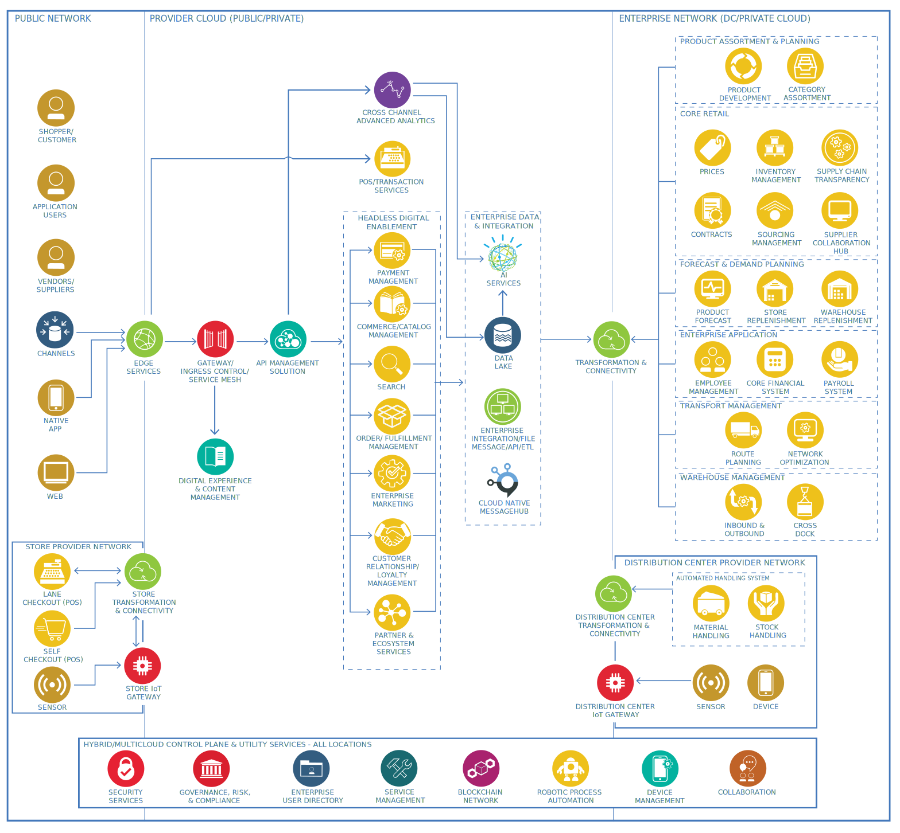

---

copyright:
  years: 2024
lastupdated: "2024-05-07"

keywords: 

subcollection: industry-ref-arch

authors:
  - name: 
    url: 

version: 1.0

deployment-url: 

docs: https://cloud.ibm.com/docs/industry-ref-arch

use-case: RetailIndustry

industry: Retail

content-type: reference-architecture

---

{{site.data.keyword.attribute-definition-list}}

## Retail and consumer packaged goods industry
{: #retail}
{: toc-content-type="reference-architecture"}
{: toc-industry="Retail"}
{: toc-use-case="RetailIndustry"}
{: toc-version="1.0"}

The Retail and consumer packaged goods industry reference architecture is a high-level view of a best-of-breed retail enterprise application landscape, including applications, functional areas, key integration points, and the associated recommended physical deployment.

The architecture addresses multi-cloud and hybrid cloud deployments, and the inclusion of machine learning and AI capabilities. The architecture components are based on industry best practices supporting the overall digital transformation of a retail enterprise.

## Architecture diagram
{: #architecture-diagram}

{: caption="Figure 1. Retail High Level Diagram" caption-side="bottom"}

