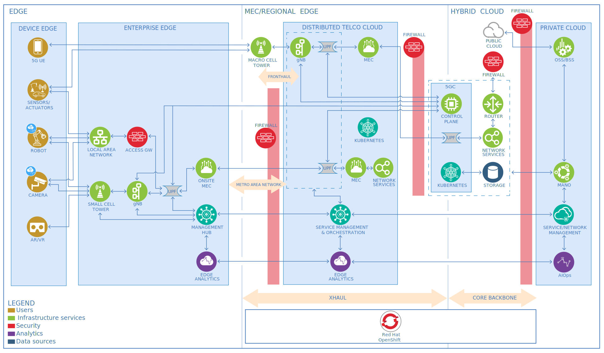

---

copyright:
  years: 2024
lastupdated: "2024-05-06"

keywords:

subcollection: industry-ref-arch

authors:
  - name:
    url:

version: 1.0

deployment-url:

docs: https://cloud.ibm.com/docs/industry-ref-arch

use-case: Telecommunications, Telecommunications infrastructure

industry: Telecommunications

content-type: reference-architecture

---

{{site.data.keyword.attribute-definition-list}}

# Telecommunications
{: #telecommunications}
{: toc-content-type="reference-architecture"}
{: toc-industry="Telecommunications"}
{: toc-use-case="Telecommunications, Telecommunications infrastructure"}
{: toc-version="1.0"}

This is the reference architecture for network edge platform.

If edge computing brings computation and data storage as close to the point where data is created and actions are taken, edge networking provides the two key features of low latency and high bandwidth to deliver the data and applications where required.

While the goal of edge computing is to move computation away from the cloud and data centers toward the edge of the network, the focus of edge networking is on network-specific components. Moving services closer to network edge locations makes content caching, storage, device management, and service delivery easier and contributes to improved transfer rates and response times.

Network in this context refers to what communications service providers (CSPs) offer and control. The network forms the backbone of all the different types of services that CSPs offer, such as voice, data, and video. Automation for the operation of services and the underlying resources that are required to test them before deployment are key to the service providers and network operators. The ability to virtualize functions and use virtualized resources is a major shift in paradigm for the CSP industry.

The network edge platform architecture contains three layers: hardware resources, virtualization layer, and virtualized functions.

## Architecture diagram
{: #architecture-diagram}

{: caption="Figure 1. Telecommunications reference architecture" caption-side="bottom"}

The major components in a network automation architecture are the hardware resources, virtualization layer, management and orchestration, OSS/BSS, and applications. Multi-access edge computing (MEC) enables the implementation of MEC applications as software-only entities that run on top of a virtualization infrastructure, which is located in or close to the network edge.

MEC and Network Functions Virtualization (NFV) are complementary concepts. The MEC architecture is designed in such a way that a number of different deployment options of MEC systems are possible.

## Nonfunctional requirements
{: #nonfunctional-requirements}

Network automation architectures must satisfy several nonfunctional requirements.

Scalability

:   The combination of NFV and edge computing brings about scalability and low latency. NFV delivers scalability for networking computing, scaling the network’s resources up or down depending on need, and application usage. Edge computing offers low latency. The latency time from transmitting data to the data center and back to the user equipment (UE) is shortened because the edge is closer to the user, creating a faster computing experience.

Reliability

:   Network slicing is possible through NFV. Different partitions (or slices) can be targeted for specific network functions. This practice ensures that high-bandwidth applications receive the networking capabilities they need without hindering the computing functions for other applications that use the same network. This also minimizes the chances for network problems. Edge computing gives network slicing an additional boost in throughput by ensuring consistent services and connectivity for high-bandwidth applications and products.

Security

:   Security is a major issue with NFV. You must be aware of the numerous attack points. Only then can a secure solution be architected. A secure NFV environment can be ensured by using a vendor-certified hardware layer and by enabling these capabilities:

   - Trust in the hypervisor layer
   - Access control in the MANO layer
   - Network segmentation
   - Traffic filtering and perimeter security in the network layer
   - Continuous scanning and monitoring
   - Proper Identity and Access Management (IAM) and certificate management at the VNF/application layer

## Components
{: #components}

The following represents a typical set of components in telecommunications applications.

| Title | Description |
| ----- | ----------- |
| 5G UE	| 5G UE is 5G-enabled user equipment such as mobile phones.|
| Sensors or actuators	| The edge device is outfitted with sensors or actuators that collect and send data.|
| Robot	| This industrial robot is used for manufacturing. Robots are automated, programmable, and can move on three or more axes.	|
| Camera	| A smart or intelligent camera is part of a machine's vision system. In addition to image capture, cameras can extract application-specific information from the captured images and make decisions.	|
| Augmented reality (AR) and virtual reality (VR)	| AR and VR are primarily used for gaming. This technology bridges the digital and physical worlds. It uses a large amount of bandwidth.	|
| gNB	| The gNB can be split as virtualized Distributed Unit (vDU) and Centralized Unit (vCU).	|
| Multi-access edge computing (MEC)	| The enterprise edge's user plane function (UPF) might offload some traffic from the private access network to a on-premises MEC installation.	|
| Inference engine	| By using visual or textual data, an inference engine applies logical rules to the knowledge base to deduce new information.	|
| User plane function (UPF) | 	The UPF is a traditional centralized 5G core network.	|
| User plane function (UPF) in the enterprise edge	| The enterprise edge converges its access traffic to a local user plane function (UPF) of the 5G Core to forward the flows that come from the small cells to external data networks, such as service providers, VPNs, and the internet.	|
| User plane function (UPF) in the distributed telco cloud	| The distributed telco cloud can contain a distributed UPF that is placed close to the 5G radio access network (RAN) to reduce the latency of the user data flows.	|
| Multi-access edge computing (MEC)	| The enterprise edge's user plane function (UPF) might offload some traffic from the private access network to a on-premises MEC installation. |
| 5G Core network	| The 5G Core Network can be deployed in a regional edge, which is a more distributed private 5G, or hybrid cloud, which mixes private and public clouds.	|
| Public cloud	| Many of the components that are shown in the private cloud can be hosted in a public cloud.	|
| Management	| Red Hat® Advanced Cluster Management controls Kubernetes clusters and applications with built-in security policies. IBM Cloud Pak® for Multicloud Management is an application-centric, AI-driven management platform that is designed to provide full visibility and control of workloads.	|
| Management and network orchestration (MANO) |	MANO coordinates network resources for cloud-based applications and the lifecycle management of virtual network functions (VNFs) and network services.	|
| Operations support system and business support system (OSS/BSS) | A BSS primarily consists of order capture, customer relationship management (CRM), and telecommunications billing. OSS covers order management, network inventory management, and network operations.	|
| AI for IT Operations (AIOps)	| IBM capabilities for AI and machine learning can be used to monitor the environment. AI models can detect changes and provide insights to identify potential problems in the network.	|
| Storage	| This component is storage for network backup and for collecting operational data about the network.	|
| xHaul	| This component manages cross-domain orchestration, which affects the transport network in the case of e2e 5G network slicing.	|
| Container platform	| A cloud container platform that is built on open-source projects such as Kubernetes. It provides a scalable and reliable cloud platform that runs on your on-premises infrastructure or with resources in a public cloud.	|
| Kubernetes	| Kubernetes is an open-source system for automating deployment, scaling, and management of containerized applications.	|
| Edge analytics	| This component is responsible for local data collection, caching, and real-time analytics for automated network control.	|
| Cell tower	| The enteprise edge might be a device edge and act as 5G user equipment to connect back to the macro-cellular network.	|
| Firewall	| A firewall is an IP security device that filters traffic and protects networks from malicious attacks.	|
| Router	| The router is the main networking device to route IP traffic.	|
| Access GW	| Access GW is a routing entity that borders an access network that can't be based on 3GPP and the provider network that is part of a mobile core infrastructure. The Access GW can initiate IPSec tunnels for data encryption security. |
| Local area network (LAN)	| Local area network (LAN) is usually based on Ethernet switching and can include wifi connectivity.	|
| Management hub	| The edge management hub manages edge nodes and the service software lifecycle on edge nodes autonomously.	|
| Small cell tower	| The enterprise edge can contain a private 5G radio access network (RAN) that is composed of small cell radio and gNB.	|
| Service management and orchestration	| A distributed service management and orchestration (SMO) subsystem as part of an open RAN architecture can access data analytics services and AI-, ML- or policy-driven closed loop operations.	|
| Network services	| A local breakout in a service provider network to the internet or private data networks, such as MPLS VPN, SD-WAN, and voice gateways.	|
| Control plane	| The control plane controls the distributed user plane function (UPF).	|
| The device edge	| The device edge holds equipment that can be connected directly to the public or private macro-cellular network, a local area network (wifi, wired Ethernet), or a private 5G small cell radio network.	|
| Metro area network	| The enterprise edge can also be connected to the wireline metropolitan area network by using Carrier Ethernet or MPLS VPN. |
{: caption="Table 1. Components" caption-side="bottom"}
